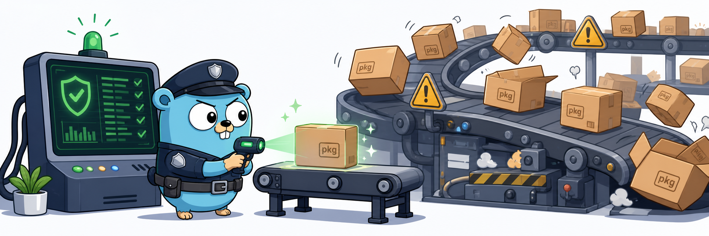

# Pkg Cop



`pkg-cop` is a small Go 1.26+ command-line scanner for package supply-chain incident response. It scans local projects, package manager caches, Python installations, and running process command lines for package/version indicators and high-confidence IOCs.

The scanner logic is generic. Incident data lives in `config.yaml`, so a new supply-chain issue can be handled by editing YAML instead of changing Go code.

## What It Detects

The scanner currently ships with a Mini Shai-Hulud / TanStack incident config that covers:

- affected npm packages using exact versions and compact version ranges
- affected PyPI packages using exact versions and compact version ranges
- affected Go modules using exact versions and semver-style ranges
- affected Rust crates using exact versions and semver-style ranges
- malicious optional dependency markers such as `@tanstack/setup`
- payload filenames such as `router_init.js`, `tanstack_runner.js`, and `transformers.pyz`
- exfiltration or payload URLs/domains
- persistence/wiper indicators such as `gh-token-monitor`
- package manager lockfiles, installed package metadata, caches, and process command lines

Any package/version selector match, IOC string, payload filename, or process match is reported as exposure evidence.

## Install

Requirements:

- Go 1.26 or newer

Download a release archive from [GitHub Releases](https://github.com/euforic/pkg-cop/releases). Release archives include:

- the `pkg-cop` binary
- `config.yaml`
- `README.md`
- `LICENSE`

Build from source:

```sh
git clone git@github.com:euforic/pkg-cop.git
cd pkg-cop
go build -o pkg-cop ./cmd/pkg-cop
```

Run without building:

```sh
go run ./cmd/pkg-cop ~/projects ~/Documents
```

## Quick Start

Scan common local source roots:

```sh
./pkg-cop ~/projects ~/Documents
```

Emit JSON for automation:

```sh
./pkg-cop -json ~/projects > scan-report.json
```

Use an explicit config:

```sh
./pkg-cop -config config.yaml ~/projects
```

Fast lockfile-oriented pass:

```sh
./pkg-cop -skip-node-modules -no-caches -no-python -no-processes ~/projects
```

## Output

Clean human output:

```text
Pkg Cop
Scanned files: 128 text files (2041 seen)
Roots: /Users/example/projects

Status: CLEAN - no known indicators found.
```

Exposure output:

```text
Pkg Cop
Scanned files: 14 text files (233 seen)
Roots: /tmp/repro

Status: EXPOSED - indicators found.
[critical] affected-package-version: /tmp/repro/package-lock.json :: @tanstack/react-router@1.169.8

Treat the host as potentially compromised if installs ran on affected versions. Rotate reachable credentials and inspect audit logs.
```

JSON output:

```json
{
  "vulnerable": true,
  "critical": 1,
  "high": 0,
  "findings": [
    {
      "severity": "critical",
      "type": "affected-package-version",
      "file": "/tmp/repro/package-lock.json",
      "detail": "@tanstack/react-router@1.169.8"
    }
  ],
  "counters": {
    "filesSeen": 233,
    "filesScanned": 14
  },
  "roots": ["/tmp/repro"],
  "guidance": "Treat the host as potentially compromised if installs ran on affected versions. Rotate reachable credentials and inspect audit logs."
}
```

## Exit Codes

- `0`: no indicators found
- `1`: one or more indicators found
- `2`: scanner, config, or runtime error

## CLI Reference

```text
Usage:
  pkg-cop [roots...] [options]

Options:
  -root PATH              Add a root to scan. Positional paths also work.
  -config PATH            YAML indicator config. Defaults to ./config.yaml or next to the executable.
  -json                   Emit machine-readable JSON.
  -quiet                  Only print findings and final status.
  -skip-node-modules      Do not scan node_modules directories.
  -no-caches              Do not add npm, Bun, pnpm, and pip cache paths.
  -no-python              Do not add Python site-package roots.
  -no-processes           Do not inspect running process command lines.
  -max-bytes N            Maximum text file size to inspect. Default: 8388608.
```

If no roots are provided, the current working directory is scanned.

## Scan Coverage

Project and dependency files:

- `package.json`
- `package-lock.json`
- `npm-shrinkwrap.json`
- `pnpm-lock.yaml`
- `yarn.lock`
- `bun.lock`
- `requirements.txt`
- `requirements-dev.txt`
- `constraints.txt`
- `pyproject.toml`
- `poetry.lock`
- `pdm.lock`
- `uv.lock`
- `Pipfile`
- `Pipfile.lock`
- `METADATA`
- `PKG-INFO`
- `go.mod`
- `go.sum`
- `Cargo.toml`
- `Cargo.lock`

Runtime and cache areas:

- explicit scan roots
- npm cache under `~/.npm`
- Bun install cache under `~/.bun/install/cache`
- pip cache under `~/.cache/pip`
- pnpm store/cache paths under the user home directory
- Go module cache from `go env GOMODCACHE` and `go env GOPATH`/`pkg/mod`
- Cargo registry sources under `~/.cargo/registry/src`
- Cargo git checkouts under `~/.cargo/git/checkouts`
- Python `site-packages` paths discovered from `python3` and `python`
- running process command lines from `ps` or `wmic`

By default, `node_modules` is scanned because installed package manifests can reveal exposure even when lockfiles are missing. Use `-skip-node-modules` for a faster pass.

## Config Format

The config is plain YAML:

```yaml
ecosystems:
  npm:
    packages:
      - name: "@scope/package"
        versions:
          - "1.2.3"
        version_patterns:
          - "1.2.x"
        version_ranges:
          - ">=2.0.0 <=2.0.4"
    scan_filenames:
      - "package-lock.json"

  pypi:
    packages:
      - name: "compromised-package"
        versions:
          - "4.2.0"
    scan_filenames:
      - "requirements.txt"
      - "METADATA"

  go:
    packages:
      - name: "github.com/example/badmod"
        version_ranges:
          - ">=1.2.0 <1.3.0"
    scan_filenames:
      - "go.mod"
      - "go.sum"

  rust:
    packages:
      - name: "bad-crate"
        version_patterns:
          - "0.9.*"
    scan_filenames:
      - "Cargo.lock"

ioc_strings:
  - "known-bad-domain.example"
  - "malicious commit hash or URL"

payload_filenames:
  - "payload.js"
  - "setup.mjs"
```

Top-level `packages` and `scan_filenames` are still supported as a backward-compatible generic bucket, but new incident configs should prefer `ecosystems` so the scanner only checks relevant package indicators for each language.

### `ecosystems`

Use `ecosystems` for language-specific package indicators. Supported ecosystem keys are `npm`, `pypi`, `go`, and `rust`.

```yaml
ecosystems:
  npm:
    packages:
      - name: "@tanstack/react-router"
        versions:
          - "1.169.5"
          - "1.169.8"
  pypi:
    packages:
      - name: "mistralai"
        versions:
          - "2.4.6"
  go:
    packages:
      - name: "github.com/example/badmod"
        versions:
          - "v1.2.3"
  rust:
    packages:
      - name: "bad-crate"
        versions:
          - "0.9.0"
```

The scanner uses the file being inspected to choose the relevant ecosystem. For example, `Cargo.lock` is checked against Rust crate indicators, not npm package indicators with the same name.

### Version Selectors

Package entries support three selector fields. Use the narrowest selector that accurately represents the incident data:

- `versions`: exact versions, with wildcard or range syntax also accepted for backward-compatible convenience.
- `version_patterns`: wildcard selectors such as `1.2.x`, `1.*`, or `0.9.*`.
- `version_ranges`: semver-style ranges such as `>=1.2.0 <=1.2.8`, `>=1.2.0 <1.3.0`, `^1.2.3`, and `~1.2.0`.

The shipped incident config uses `version_ranges` for contiguous affected patch runs and keeps sparse, non-contiguous version lists in `versions`. That avoids broadening indicators beyond the published affected versions while keeping the YAML readable.

For Go modules, exact versions should use Go's version string, including the `v` prefix:

```yaml
ecosystems:
  go:
    packages:
      - name: "github.com/acme/compromised"
        versions:
          - "v1.2.3"
        version_ranges:
          - ">=1.2.0 <1.3.0"
```

For Rust crates, use the crate name exactly as it appears in `Cargo.toml` or `Cargo.lock`:

```yaml
ecosystems:
  rust:
    packages:
      - name: "compromised-crate"
        versions:
          - "0.4.2"
        version_patterns:
          - "0.4.x"
```

### `scan_filenames`

Each ecosystem can define `scan_filenames` to extend or narrow which basenames are treated as package metadata for that language:

```yaml
ecosystems:
  npm:
    scan_filenames:
      - "package-lock.json"
      - "pnpm-lock.yaml"
  pypi:
    scan_filenames:
      - "requirements.txt"
      - "METADATA"
```

The scanner also has built-in defaults for common npm, PyPI, Go, and Rust manifest and lockfile names. Keep custom filename lists focused. Adding broad names like `index.js` across large repositories will slow scans and increase false positives.

### `ioc_strings`

Use `ioc_strings` for high-confidence strings that should never appear on a clean host:

```yaml
ioc_strings:
  - "https://bad.example/payload.js"
  - "malicious-domain.example"
  - "known malicious commit hash"
```

These are searched directly in scanned text files and process command lines.

### `payload_filenames`

Use `payload_filenames` for suspicious filenames:

```yaml
payload_filenames:
  - "payload.js"
  - "runner.mjs"
  - "persistence.service"
```

If a file with this basename is found under a scanned root, it is reported even before file content is read.

## Creating A New Incident Config

1. Copy the shipped config:

   ```sh
   cp config.yaml my-incident.yaml
   ```

2. Replace or append affected package/version entries under the right ecosystem. Prefer `version_ranges` for contiguous affected patch runs and `versions` for sparse versions:

   ```yaml
   ecosystems:
     pypi:
       packages:
         - name: "compromised-package"
           version_ranges:
             - ">=4.2.0 <=4.2.3"
   ```

3. Add unique IOCs:

   ```yaml
   ioc_strings:
     - "attacker.example"
     - "known-bad-token-name"
   ```

4. Add payload or persistence filenames:

   ```yaml
   payload_filenames:
     - "postinstall.js"
     - "agent.service"
   ```

5. Run against a fixture before scanning real systems:

   ```sh
   mkdir -p /tmp/scan-fixture
   printf 'compromised-package==4.2.2\n' > /tmp/scan-fixture/requirements.txt
   ./pkg-cop -config my-incident.yaml -no-caches -no-python -no-processes /tmp/scan-fixture
   ```

6. Scan real roots:

   ```sh
   ./pkg-cop -config my-incident.yaml ~/projects ~/Documents
   ```

## Updating The Shipped Config

When new indicators are published:

1. Add package/version entries to the right `ecosystems.<name>.packages` list.
2. Add domains, URLs, hashes, or marker strings to `ioc_strings`.
3. Add payload or persistence filenames to `payload_filenames`.
4. Add any new lockfile or metadata filenames to the right ecosystem `scan_filenames`.
5. Keep selectors narrow: use `version_ranges` for contiguous patch runs, `version_patterns` only when the advisory really affects an entire wildcard set, and exact `versions` for sparse lists.
6. Run tests:

   ```sh
   go test ./...
   ```

7. Build and run a clean local scan:

   ```sh
   go build -o pkg-cop ./cmd/pkg-cop
   ./pkg-cop -no-caches -no-python -no-processes -skip-node-modules .
   ```

## Remediation Guidance

If the scanner reports exposure:

1. Treat the host or CI runner as potentially compromised.
2. Identify whether package install scripts ran in the affected environment.
3. Rotate credentials reachable from that environment.
4. Inspect GitHub, npm, PyPI, cloud, CI, Kubernetes, Vault, SSH, and artifact registry audit logs.
5. Remove suspicious persistence files and payloads only after preserving evidence if incident response requires it.
6. Reinstall dependencies from clean lockfiles and known-good package versions.

This scanner is an indicator scanner. It does not prove a host or CI runner is clean, and it does not replace audit-log review.

## Project Layout

The project follows the usual small Go CLI layout:

```text
cmd/pkg-cop/          CLI entrypoint
internal/cli/         flag parsing, exit codes, output selection
internal/config/      YAML config loading and validation
internal/scanner/     scan engine, matchers, reports, and tests
internal/set/         tiny local set helper
config.yaml           shipped indicator config
```

Incident data belongs in `config.yaml`. Scanner behavior belongs in `internal/scanner`. The command in `cmd/pkg-cop` should stay thin.

## Development

Run tests:

```sh
go test ./...
```

Build:

```sh
go build -o pkg-cop ./cmd/pkg-cop
```

## Releases

Releases are built with GoReleaser through GitHub Actions.

Create a release by pushing a version tag:

```sh
git tag v0.1.0
git push origin v0.1.0
```

The release workflow builds Linux, macOS, and Windows artifacts for `amd64` and `arm64`, packages `config.yaml` with each archive, and publishes checksums.

You can also run a snapshot build locally if GoReleaser is installed:

```sh
goreleaser release --snapshot --clean
```

The tests use real temporary files and scanner logic. They do not mock the parser or filesystem scanner.
